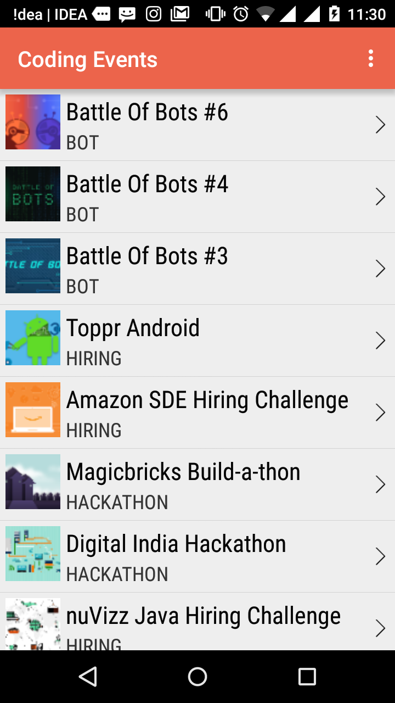
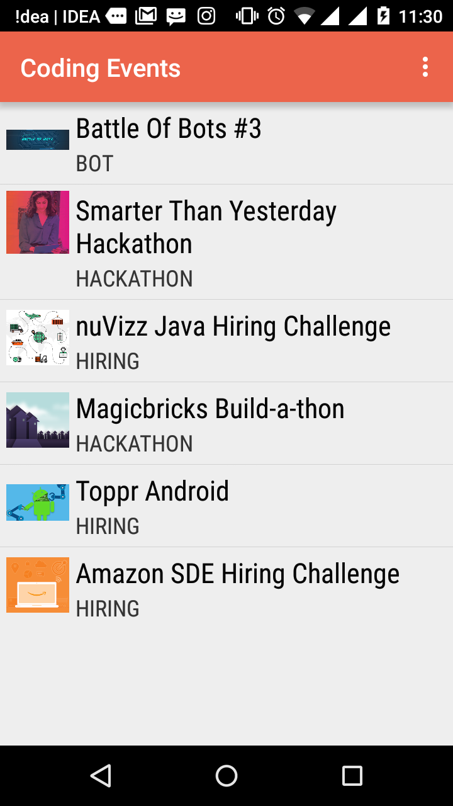

Toppr Events
=======

A Coding Event Forecaster relying on HackerEarth API, built as a part of 12-Hour Hackathon organized by Toppr on HackerEarth.

###Install

Clone the project and import it with Android Studio .

###Contributing

Feel free to add anything :code enhancement ...

Fork it , clone it and push commits ! .

